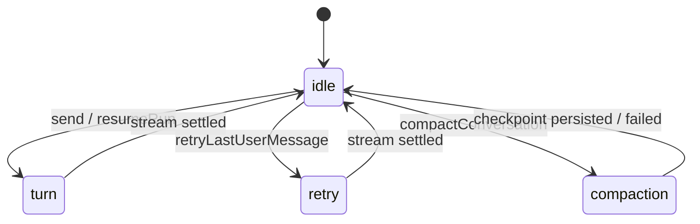

# Aila Architecture Rules

These invariants were previously enforced by contract scripts under `scripts/`
(now deleted). Treat every rule below as binding when editing. Verification is
`bun run lint`, `bun run typecheck`, `bun run build`, and manual smoke runs —
there is deliberately no test suite (see AGENTS.md).

## Layering & Package Boundaries

- `@aila/agent` is Node-free: no `node:*`, `electron`, or `@aila/agent-node`
  imports. Filesystem paths flow through the host; use `TextEncoder`, never
  `Buffer`.
- Packages never import app source. Consumers use workspace exports only — no
  deep `packages/*/src` imports.
- The desktop renderer never imports `@aila/agent-node`. Preload and main may
  use `@aila/agent-node/app` (electron.vite aliases it).
- `@aila/agent-node` declares `@aila/agent` as `workspace:*`.
- No `pi-ai` dependency anywhere — Aila owns its model boundary and providers.
- `AgentRuntime` is the sole model/tool orchestrator over the pure `RunMachine`.
  The durable executor delegates to `defaultAgentRuntime` and never calls
  `runDurableRun` directly.
- `runDurableRun` / `advanceRun` are importable only via `@aila/agent/internal`;
  `createToolRegistry` / `executeTool` / `getToolDefinitions` only via
  `@aila/agent/host`.
- The root `@aila/agent` export must not re-expose internal machinery
  (`RunState`, `RunTransition`, `runDurableRun`, host-store internals).
- CLI and TUI import only `@aila/agent` and `@aila/agent-node/app`.

## Runtime & Persistence

- Host boundary: settings, model streaming, model info, attachments, transient
  and stable context, tool execution, images, web search, and shell all flow
  through `WorkbenchHost`. Runtime core stays Node-free.
- The store is injectable; optional store capabilities fail closed.
- The session journal is append-only and the single source of truth; run
  snapshots are computed read-views rebuilt from the journal on demand, never
  persisted. Entries are immutable once written (byte-identical duplicates are
  idempotent; any difference throws).
- Run events are schema-versioned, deduped by `eventId`, and replay
  deterministically; append order is stable at equal timestamps.
- `run.payload` entries use the API vocabulary (`model_request`,
  `model_response`, `tool_batch`, `tool_request`, `tool_result`,
  `compaction`); there is no legacy vocabulary and no read-time normalization.
- Session fork copies only the selected root-to-leaf semantic path.
- Structural session operations (navigate, fork, garbage-collect, compact)
  require the idle phase.
- Runs interrupted mid-tool are marked `manual_review` and must not auto-resume.
- Exactly one provider request per model step.
- Step mode pauses before tool steps; tool approval pauses before side effects
  (`safe` ⇒ ask on destructive writes, `yolo` ⇒ allow).
- Turn starts serialize per session; abort, delete, and shutdown persist their
  cancellation and never leak an active turn.

## Desktop

- The chat canvas stays full-width and contains no run controls or step-mode
  chrome — the debug workbench owns run inspection and control.
- The renderer hydrates conversations via the runtime lifecycle API only; no
  raw conversation reads from the store.
- Main constructs the workbench exclusively through
  `createDesktopRuntimeWorkbench` + `registerRuntimeWorkbenchIpcHandlers` —
  one construction path, one IPC registration path.
- ESM-safe paths only: resolve from `import.meta.url`, never `__dirname`.
- No embedded terminal (no PTY dependencies, no terminal IPC).
- The chat stream reducer is monotonic: finished messages are never downgraded
  or mutated by late or stale events; dropped conversations tombstone.
- Preload types re-export from `@aila/agent` (type-only re-exports from
  `@aila/agent-node/app` are allowed); hand-copied type duplicates are
  forbidden — they drift.

## CLI / TUI

- `--retry-last` never duplicates user messages and appends exactly one
  assistant message.
- `turn.interrupted` completes the adapters with an error and preserves
  partial text.

## Runtime Lifecycle

Hosts observe the runtime through `WorkbenchHost.hooks`
(`RuntimeLifecycleHooks`): typed, stage-grouped callbacks that are dispatched
synchronously, never awaited, isolated by try/catch, and handed cloned
payloads. Hooks observe; they never decide. Decision points remain the
dedicated host fields (`onToolPolicy`, `onToolApproval`). The hooks surface is
reserved for the planned extension system — it has no first-party consumer
yet, and that is deliberate, not dead code.

### Session phase state machine

Crash recovery bulk-resets non-idle phases to `idle` at startup.

### Turn pipeline and firing points

One turn flows: guards → `turn.onStarting` → phase write
(`session.onPhaseChanged`) → context assembly (`context.onAssembled`) →
durable run loop — every persisted run event fans out through one funnel that
also drives the `turn.*` / `run.*` / `step.*` hooks — → assistant message
commit (`turn.onCommitted`) → idle phase write. Save points fire
`run.onSavePoint` after the journal flush. Two event channels predate hooks
and are unchanged: `host.onEvent` (process-wide workbench events) and the
per-session subscription used by `WorkbenchRuntime.subscribeSession`; hooks are a
third, purely additive observation channel.

### Stage table

| Hook | Seam | Fires on replay/recovery |
| --- | --- | --- |
| session.onCreated / onRenamed / onDeleted / onNavigated / onForked | the corresponding engine/catalog operation, after persistence | no |
| session.onPhaseChanged | every `session.phase.changed` append (incl. crash-recovery reset) | recovery reset only |
| turn.onStarting | turn setup, before the phase write | no |
| turn.onCommitted | every committed transcript message (user and assistant) | no |
| turn.onStarted / onCompleted / onFailed / onAborted | run-event funnel (`turn.*` events; `interrupted` maps to onAborted) | yes |
| run.onStarted / onPaused / onResumed / onCompleted / onFailed / onCancelled | run-event funnel (`run.*` events) | yes |
| run.onSavePoint | durable-run save point, after journal flush | no |
| step.onStarted / onCompleted / onFailed / onCancelled | run-event funnel (`step.*` events) | yes |
| tool.onPolicy / onApprovalRequested / onApprovalResolved | live wrappers around the host policy/approval calls | no |
| tool.onExecutionStarted / onExecutionCompleted | durable-run stream handlers | no |
| context.onAssembled | after context token preflight in turn setup | no |
| context.onCompacting / onCompacted | checkpoint persistence (manual and auto) | no |

Tool and context **run events** are deliberately excluded from the run-event
funnel mapping — their hooks fire from the live seams above and would
double-fire otherwise.

### Kernel ports are not host hooks

`RunMachineOptions` callbacks (`prepareModelStep`, `executeToolStep`,
`onTransition`, …) and `RunPolicy.afterModel/afterTools` are executor
internals owned by the durable-run layer. Embedders extend the runtime through
`WorkbenchHost` and `hooks`, never by reaching into kernel ports.
