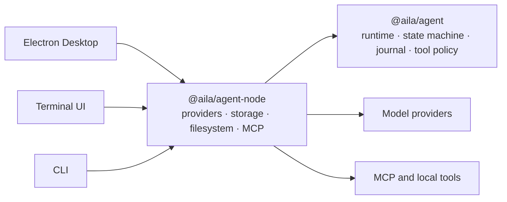

# Aila

Aila is an experimental agent runtime and workbench for building inspectable,
resumable, tool-using agents across Desktop, TUI, and CLI interfaces.

> [!WARNING]
> Aila is still in an early stage. Expect breaking changes, incomplete features,
> and rough edges. It is not recommended for production use yet.

## What is here today

- A Node-free runtime core built around `AgentRuntime` and a pure `RunMachine`
- Durable sessions backed by an append-only event journal
- Deterministic replay, session forking, context compaction, and persisted run state
- Pause, resume, step mode, tool policy, and approval before side effects
- Provider adapters for Anthropic, OpenAI, Google, OpenRouter, and compatible APIs
- MCP connections over stdio, SSE, and Streamable HTTP
- Electron Desktop, terminal UI, and command-line interfaces over the same runtime

## Architecture



`@aila/agent` contains the platform-neutral runtime. Node.js and Electron
capabilities stay behind host adapters in `@aila/agent-node`, so the same run
semantics can be reused by each interface.

## Repository layout

| Path | Purpose |
| --- | --- |
| `packages/agent` | Node-free runtime, run state machine, session journal, context, and tool policy |
| `packages/agent-node` | Node.js host adapters, model providers, persistence, MCP, and local tools |
| `apps/desktop` | Electron desktop workbench |
| `apps/tui` | Full-screen and line-mode terminal UI |
| `apps/cli` | Scriptable command-line interface |
| `website` | Project website |

## Getting started

### Prerequisites

- [Bun](https://bun.sh/) 1.3.14
- An API key or supported account for at least one model provider

### Install and run

```bash
git clone https://github.com/FoundDream/Aila.git
cd Aila
bun install
bun run dev
```

Open **Settings → Provider** in the desktop app to add a model connection.
Credentials entered in the desktop app are stored through Electron's secure
storage boundary.

The terminal interfaces use the same persisted runtime:

```bash
bun run tui
bun run cli -- --help
```

For CLI use, provide the corresponding environment variable, such as
`OPENAI_API_KEY`, `ANTHROPIC_API_KEY`, or `OPENROUTER_API_KEY`.

## Development

```bash
bun run lint
bun run typecheck
bun run build
```

The repository deliberately has no automated test suite yet. TypeScript
validation, builds, and manual smoke runs are the current verification boundary.
This is an active limitation, not a production-readiness claim.

Architecture invariants are documented in [CLAUDE.md](./CLAUDE.md), while
contribution and repository workflow rules live in [AGENTS.md](./AGENTS.md).

## Project status

Aila is suitable for reading, experimenting with, and discussing agent-runtime
design. It does not yet provide stable APIs, compatibility guarantees, release
artifacts, or a production support policy.

## License

[MIT](./LICENSE) © Ziwen Song
